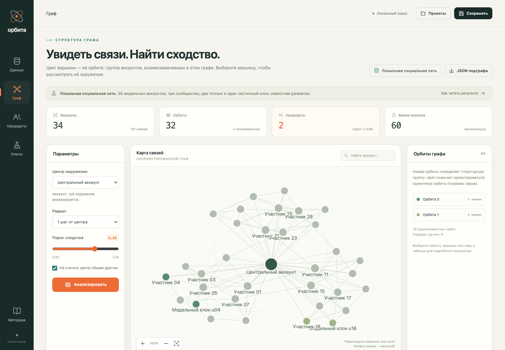
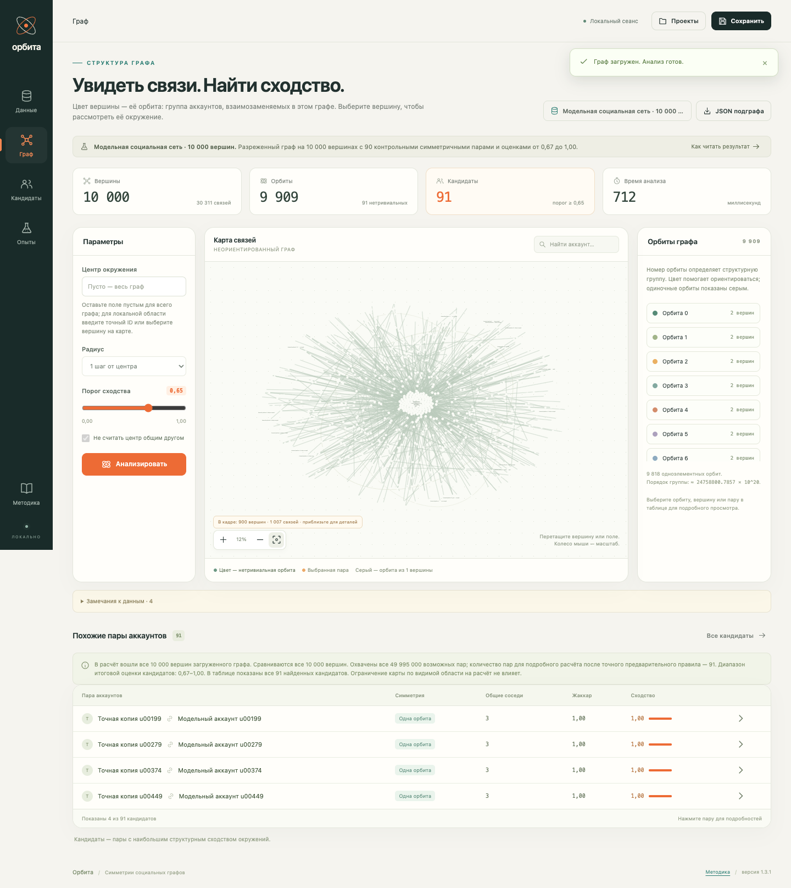
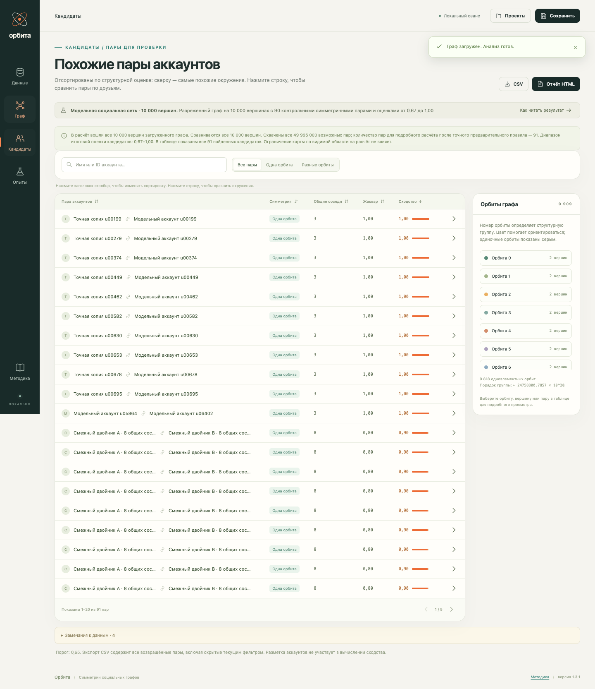
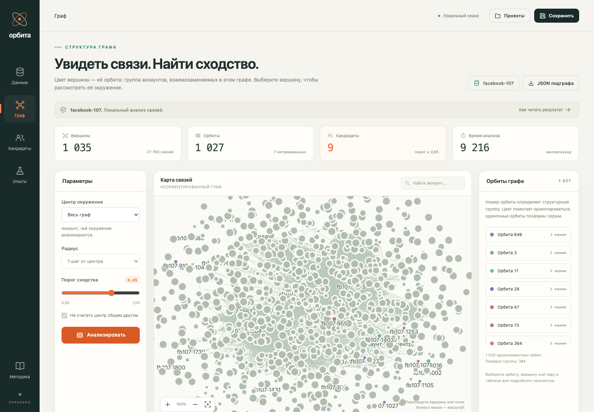
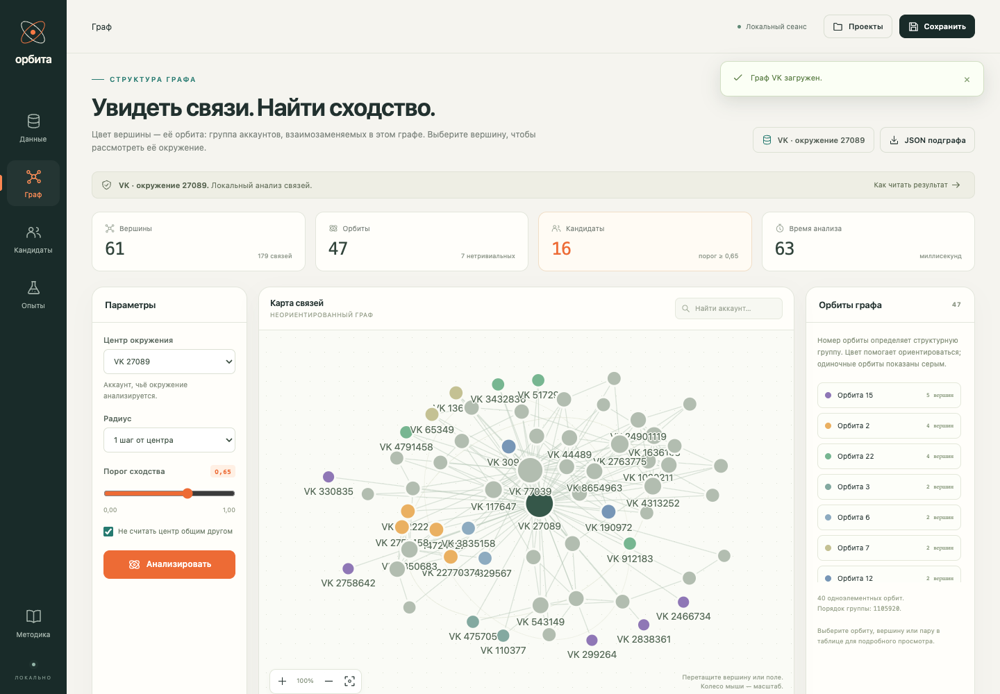

# Орбита

[](https://www.python.org/)
[](#проверка)
[](#запуск-через-docker)
[](LICENSE)



Локальное приложение для исследования симметрий социальных графов и поиска структурно похожих аккаунтов. Практическая часть дипломной работы «Выявление клонов и ботов в локальных подграфах социальных сетей с использованием симметрий графов».

Приложение вычисляет точные орбиты автоморфизмов графа (nauty), сопоставляет их с коэффициентом Жаккара окружений и показывает пары аккаунтов-кандидатов с объяснением причины выделения. Встроенный режим экспериментов добавляет в граф модельные копии с частично скопированными связями и шумом и сравнивает три правила отбора (Жаккар, симметрия, комбинация) по Precision / Recall / F1.

## Возможности

- **Точный анализ симметрий** — орбиты и порядок группы автоморфизмов через nauty/pynauty, с фиксацией корневой вершины; на контрольных графах сверено с полным перебором перестановок (`tools/verify_theory.py`).
- **Структурное сходство** — Жаккар окрестностей, орбитальный признак, интегральная оценка `S = (O + J) / 2`, распознавание смежных/несмежных близнецов; каждая пара сопровождается объяснением (общие соседи, различия окружений, орбита).
- **Данные** — импорт CSV/JSON до 20 000 вершин и 500 000 рёбер, сбор окружения пользователя VK через официальный API (токен не покидает машину), модельные примеры и реальные эго-сети SNAP ego-Facebook.
- **Эксперименты** — внедрение клонов с настраиваемым retention, шум рёбер, контрольные прогоны, фиксированные seed — полностью воспроизводимый протокол.
- **Большие графы** — точный интерактивный анализ поддерживает область до 10 000 вершин и 500 000 рёбер. Для разреженных графов пары, которые математически не могут достичь порога, исключаются точным предварительным правилом; исходный набор до 20 000 вершин можно анализировать локальными областями.
- **Интерфейс** — интерактивный SVG-граф с раскраской по орбитам, зумом и поиском. Карта виртуализирована: в DOM попадают только объекты текущего кадра, не более 900 вершин и 3500 рёбер одновременно.
- **Экспорт** — JSON графа, CSV кандидатов, автономный HTML-отчёт; локальные проекты.

## Быстрый старт

### Docker

```bash
docker compose up --build
```

Приложение откроется на **http://127.0.0.1:8787**. Токен VK кладётся в `.env` рядом с compose.yaml (см. `.env.example`); без токена работает всё, кроме сбора VK. Сохранённые проекты хранятся в docker-томе.

### Локальный Python (3.11+, рекомендуется 3.12)

```bash
python3 -m venv .venv
.venv/bin/python -m pip install -e .
.venv/bin/python run.py
```

Токен VK — переменная окружения `VK_TOKEN` или файл `.env` (см. `.env.example`).

## Примеры данных

В `examples/` лежат готовые графы: модельная социальная сеть с известными клонами (`social.json`), шумная сеть с частичным клоном (`noisy.json`), звезда, граф Фрухта, 10 эго-сетей SNAP, их объединение `facebook-large.json` и синтетический разреженный граф `social-10000.json` ровно на 10 000 вершинах. Подробности — в `examples/README.md`.

Пример анализа из командной строки:

```bash
.venv/bin/python -m app.cli analyze examples/social.json --root ego --out output/demo
.venv/bin/python -m app.cli analyze examples/facebook-large.json --root 1684 --radius 2 --out output/large-facebook
.venv/bin/python -m app.cli analyze examples/social-10000.json --out output/social-10000
.venv/bin/python -m app.cli experiment examples/social.json --root ego --retention 0.8 --noise 0 0.05 0.15 --repeats 3 --seed 42 --out output/experiment
```

Контрольный прогон `social-10000.json` охватывает все 10 000 вершин и 49 995 000 возможных неупорядоченных пар. В граф внедрены 90 симметричных пар двух типов: 10 несмежных структурных копий и 80 смежных двойников с 1–8 общими внешними соседями. При пороге 0,65 точное предварительное правило оставляет для подробного расчёта 91 пару: все 90 контрольных и одну естественную пару базового графа. Итоговая оценка кандидатов распределена по девяти уровням от 0,67 до 1,00, а коэффициент Жаккара — от 0,33 до 1,00. На тестовой машине весь анализ занимает около 0,9 секунды. Ограничение SVG до 900 вершин и 3500 рёбер относится только к текущему кадру карты.

## Методика

Для пары вершин `u, v` вычисляются:

- `J(u,v) = |A(u) ∩ A(v)| / |A(u) ∪ A(v)|` — Жаккар сравниваемых окрестностей (корень исключается);
- `O(u,v) ∈ {0, 1}` — обе вершины в одной нетривиальной точной орбите при непустых окрестностях;
- `S(u,v) = (O + J) / 2` — интегральная оценка; кандидат при `S ≥ порог` и ненулевом признаке.

При пороге выше 0.5 правило требует общей точной орбиты: разрушение симметрии частичным копированием оставляет кандидата только по Жаккару при пониженном пороге — этот эффект исследуется встроенными экспериментами. Полные определения, протокол экспериментов и ограничения — [docs/METHODOLOGY.md](docs/METHODOLOGY.md).

## Проверка

```bash
.venv/bin/python -m pip install -e ".[dev]"
.venv/bin/python -m pytest          # 151 тест
PYTHONPATH=. .venv/bin/python tools/verify_theory.py     # орбиты vs полный перебор перестановок
PYTHONPATH=. .venv/bin/python tools/verify_detection.py  # обнаружение внедрённых клонов на SNAP
ORBITA_URL=http://127.0.0.1:8787 node tests/browser-large.cjs  # viewport-отрисовка большого графа
ORBITA_URL=http://127.0.0.1:8787 node tests/browser-10000.cjs  # полный расчёт примера на 10 000 вершинах
```

## Структура проекта

```
app/        сервер: ingest, analysis (nauty), experiments, exports, vk, storage, main
static/     интерфейс без сборщика и внешних CDN
tests/      математические, импортные и интеграционные проверки
tools/      верификация теории и обнаружения, конвертер SNAP
examples/   модельные и реальные графы с описанием
docs/       методика и скриншоты
```

## Скриншоты





| Карта связей (1035 вершин, SNAP facebook-107) | Живой граф VK (сбор по API) |
|---|---|
|  |  |

## Границы применения

Оценка `S` измеряет структурное сходство окружений и не является вероятностью того, что аккаунт — бот или клон личности: при экспериментальной оценке измеряется восстановление известных синтетических добавлений. Для выводов о настоящих ботах нужна независимая размеченная выборка (например, TwiBot-22). Симметрия встречается и у обычных пользователей — кандидаты предназначены для дальнейшей содержательной проверки.

## Лицензия

[MIT](LICENSE)
